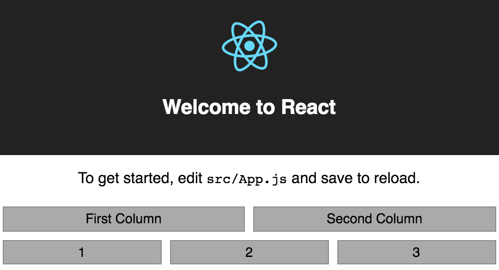

# fluid-react

Base on Bootstrap 12 column grid system. A mobile-first grid system for React.

```
npm install --save fluid-react
```

## Grid

`App.js`
```
import React, { Component } from 'react';
import logo from './logo.svg';
import './App.css';

import { Row, Col } from 'fluid-react';

class App extends Component {
    render() {
        const cellStyle = {
            background: '#aaa',
            margin: '5px',
            padding: '5px',
            border: '1px solid #888'
        }
        return (
            <div className="App">
                <header className="App-header">
                    
                    <h1 className="App-title">Welcome to React</h1>
                </header>
                <p className="App-intro">
                    To get started, edit <code>src/App.js</code> and save to reload.
                </p>
                <Row>
                    <Col xs="12" sm="6">
                        <div style={cellStyle}>First Column</div>
                    </Col>
                    <Col xs="12" sm="6">
                        <div style={cellStyle}>Second Column</div>
                    </Col>
                </Row>
                <Row>
                    <Col>
                        <div style={cellStyle}>1</div>
                    </Col>
                    <Col>
                        <div style={cellStyle}>2</div>
                    </Col>
                    <Col>
                        <div style={cellStyle}>3</div>
                    </Col>
                </Row>
            </div>
        )
    }
}
```


